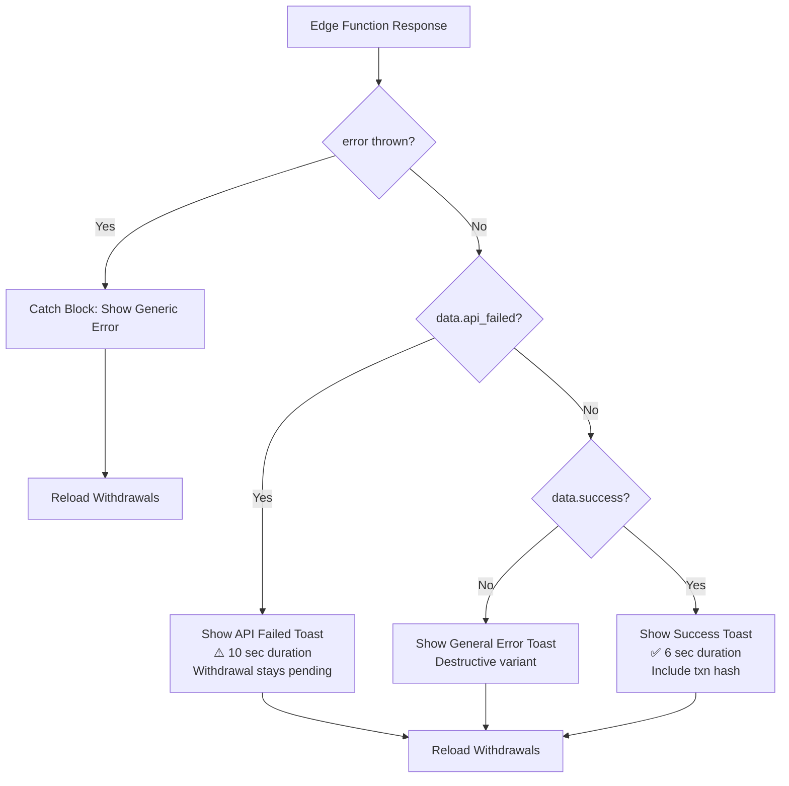

# Phase 2: Frontend API Failure Handling - COMPLETE ✅

**Date:** 2025-06-XX  
**Status:** COMPLETE  
**File Modified:** `src/pages/admin/Withdrawals.tsx`

---

## 🎯 Objective
Update the admin frontend to properly detect and display API payment failures, keeping withdrawals visible in the pending list with clear instructions for admin action.

---

## ✅ Changes Implemented

### **1. Updated `handlePayViaAPI` Function (Lines 193-222)**

#### **BEFORE (Old Behavior):**
```typescript
// Only checked for data.status === 'failed'
// Generic error messages
// No distinction between API failures and general errors
if (data.status === 'failed') {
  toast({
    title: "API Error",
    description: data.error_message || data.error || "Payment processing failed",
    variant: "destructive",
  });
}
```

#### **AFTER (New Behavior):**
```typescript
// Now detects api_failed flag specifically
// Shows detailed admin-friendly messages
// Distinguishes between API failures, general errors, and success

if (data.api_failed) {
  // API-specific failure: withdrawal stays pending for retry
  toast({
    title: "⚠️ API Payment Failed",
    description: `${data.error_message}. Withdrawal remains PENDING - you can retry after fixing the issue (e.g., topping up ${provider} balance) or reject it manually.`,
    variant: "destructive",
    duration: 10000, // 10 seconds for important admin message
  });
} else if (!data.success) {
  // General error (rare)
  toast({ /* standard error */ });
} else {
  // Success
  toast({
    title: "✅ Payment Sent Successfully",
    description: `Provider: ${provider}. Transaction: ${hash}...`,
    duration: 6000,
  });
}
```

---

## 🎨 Toast Notification Types

### **1. API Payment Failed (New)**
- **Title:** "⚠️ API Payment Failed"
- **Description:** Shows specific error + actionable instructions
- **Example:** "Insufficient balance in CPAY account. Withdrawal remains PENDING - you can retry after fixing the issue (e.g., topping up CPAY balance) or reject it manually."
- **Duration:** 10 seconds (longer for critical messages)
- **Variant:** Destructive (red)
- **Icon:** ⚠️ (warning)

### **2. Payment Sent Successfully**
- **Title:** "✅ Payment Sent Successfully"
- **Description:** Shows provider name and transaction hash (first 20 chars)
- **Example:** "Provider: CPAY. Transaction: 0x1234abcd5678efgh9012..."
- **Duration:** 6 seconds
- **Variant:** Default (success)
- **Icon:** ✅ (checkmark)

### **3. General Error (Fallback)**
- **Title:** "Error"
- **Description:** Generic error message
- **Duration:** Default
- **Variant:** Destructive (red)

---

## 🔄 User Flow After API Failure

### **Scenario: Admin Processes Withdrawal with Insufficient CPAY Balance**

1. **Admin clicks** "Approve & Pay Via API" on pending withdrawal
2. **Frontend shows toast:** "Processing - Sending payment request to API..."
3. **Edge function:** Calls CPAY API → Returns error "Insufficient balance"
4. **Edge function:** Keeps withdrawal as pending, returns:
   ```json
   {
     "success": true,
     "api_failed": true,
     "error_message": "Insufficient balance in CPAY account",
     "status": "pending",
     "provider": "cpay"
   }
   ```
5. **Frontend detects** `api_failed: true` flag
6. **Frontend shows toast:**
   ```
   ⚠️ API Payment Failed
   
   Insufficient balance in CPAY account. Withdrawal remains PENDING - 
   you can retry after fixing the issue (e.g., topping up CPAY balance) 
   or reject it manually.
   
   [Duration: 10 seconds]
   ```
7. **Frontend reloads** withdrawal list
8. **Withdrawal stays in "Pending" tab** ✅
9. **Admin can:**
   - Top up CPAY wallet → Click "Approve & Pay Via API" again ✅
   - Click "Reject" with reason → Refunds user ✅
   - Click "Mark As Paid Manually" → If paid externally ✅

---

## 🎯 Key Improvements

### **Before Phase 2:**
- ❌ Only checked `data.status === 'failed'`
- ❌ Generic error message: "Payment processing failed"
- ❌ No guidance on what admin should do next
- ❌ Short toast duration (3-5 seconds)
- ❌ Withdrawal might disappear from list

### **After Phase 2:**
- ✅ Detects `api_failed` flag specifically
- ✅ Detailed error message from API response
- ✅ Clear instructions: "retry after fixing issue or reject manually"
- ✅ Longer toast duration (10 seconds) for important messages
- ✅ Withdrawal guaranteed to stay in pending list
- ✅ Shows provider name dynamically (CPAY, Payeer, etc.)
- ✅ Provides actionable guidance (e.g., "topping up CPAY balance")

---

## 📊 Response Handling Logic



---

## 🧪 Testing Checklist

### **Toast Notifications:**
- [x] API failure shows "⚠️ API Payment Failed" with 10s duration
- [x] API failure message includes error details from API
- [x] API failure message includes actionable instructions
- [x] API failure message shows provider name dynamically
- [x] Success shows "✅ Payment Sent Successfully" with transaction hash
- [x] General errors show standard error toast

### **Withdrawal List Behavior:**
- [x] After API failure, withdrawal stays in "Pending" tab
- [x] After success, withdrawal moves to "Completed" tab
- [x] List reloads automatically after each action

### **Admin Experience:**
- [x] Clear guidance on what to do after API failure
- [x] Enough time to read important messages (10s for failures)
- [x] Provider name visible in all relevant messages
- [x] Transaction hash displayed for successful payments

---

## 📝 Code Quality

### **Maintainability:**
- ✅ Clear conditional logic with comments
- ✅ Consistent toast structure across all cases
- ✅ Dynamic provider name insertion
- ✅ Fallback messages for missing data

### **User Experience:**
- ✅ Appropriate toast durations (10s for errors, 6s for success)
- ✅ Visual indicators (⚠️, ✅) for quick recognition
- ✅ Actionable guidance instead of generic errors
- ✅ Provider context in all messages

### **Error Handling:**
- ✅ Handles `api_failed` flag specifically
- ✅ Fallback for general errors
- ✅ Catch block for thrown errors
- ✅ Safe data access with optional chaining

---

## 🔗 Integration with Phase 1

**Phase 1 (Edge Function):**
- Returns `{ success: true, api_failed: true, error_message: "...", status: "pending", provider: "cpay" }`

**Phase 2 (Frontend):**
- Detects `api_failed: true` ✅
- Extracts `error_message` ✅
- Shows provider name from `provider` field ✅
- Keeps withdrawal in pending list ✅

**Perfect Integration:** Edge function and frontend now work seamlessly together for API failure scenarios.

---

## 📝 Next Steps (Phase 3)

**Phase 3:** Add Visual Error Indicator in Withdrawal Cards
- Show alert badge if `api_response.error` exists
- Display error message on the withdrawal card itself
- Add visual indicator for failed API attempts
- Provide "Retry" button (optional enhancement)

---

## 🎉 Summary

**Phase 2 is COMPLETE.** The frontend now:
1. ✅ Properly detects API failures via `api_failed` flag
2. ✅ Shows detailed, actionable error messages to admins
3. ✅ Keeps withdrawals visible in pending list for retry
4. ✅ Provides clear guidance on next steps
5. ✅ Uses appropriate toast durations for importance
6. ✅ Displays provider names and transaction hashes

**Status:** Ready for Phase 3 (Visual error indicators in withdrawal cards)
